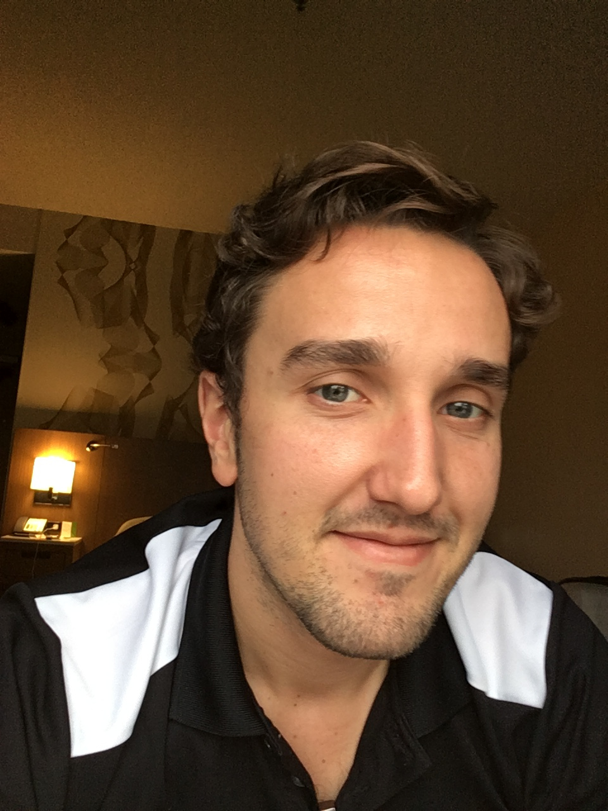

I am a Postdoctoral Fellow at the [Mathematical Biosciences Insititute](http://mbi.osu.edu/) at [The Ohio State Univerisity](https://www.osu.edu/).  I try to model the variability and dynamics associated with physical systems.  In 2015, I received my PHD from the [Department of Statistics](http://statistics.rice.edu/) under the direction of [Dennis Cox](http://statistics.rice.edu/feed/FacultyDisplay.aspx?FID=268) and [Marek Kimmel](http://statistics.rice.edu/feed/FacultyDisplay.aspx?FID=270).  
I completed my undergraduate education at
[UT-Dallas](http://www.utdallas.edu/math/) in 2009.

Some of my current research is listed in on [this page](/research/).
If you're interested in obtaining a draft of any of the working
papers, please feel free to email me.

My teaching experience is listed [here](/teaching/) along with (some)
of my notes.

If you want a pdf of my CV, you can get that [here](/cv/cv.pdf)

